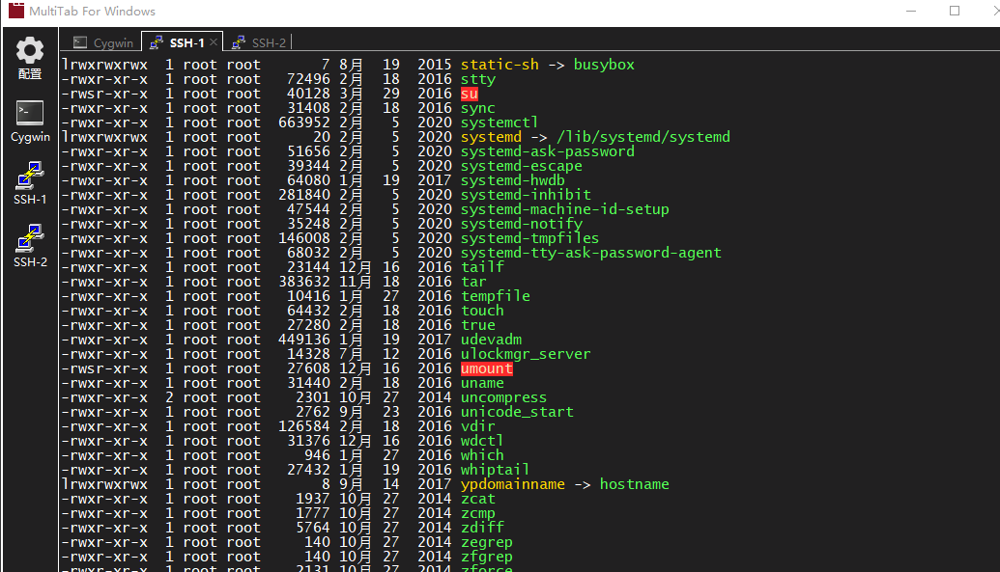

# 背景
Putty和Cygwin每个会话都是单独的窗口，管理使用起来不太方便。该项目为它们提供多标签支持。

# 安装
点击[下载](../../releases/download/v1.0/MultiTab.7z)，解压即可使用

# 配置
点击 **配置**, 打开配置文件。修改Putty或Cygwin的路径和启动参数，保存。
点击 **Putty** 或 **Cygwin** 即可在标签页中开启新会话。

当然你也可以按照个人需求参考 **Putty** 或 **Cygwin** 配置组格式，增加新的配置组。
不同的组通过 **name** 进行区分。

注意: 配置文件为YAML文件，请确保格式正确

# 使用许可
[wxWindows Library Licence](LICENSE)

# 截图

